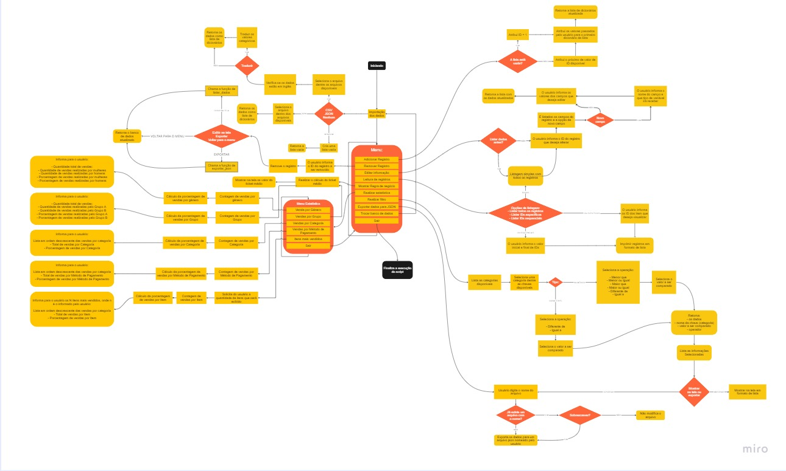

# CRUD de dados de vendas
- Projeto Final do Módulo 2 do curso Vem Ser Tech ADA + iFood

# Apresentação Projeto
Esse projeto é uma aplicação em Python que permite fazer diversas manipulações de registros. O programa utiliza um menu interativo o qual permite que o usuário realize operações, como adicionar, remover e editar registros, realizar leitura e filtragem de dados, gerar estatística, exportar dados para JSON e visualizar regra de negócio.

 ## Grupo B:

- Adriely
- Amanda
- Daniel Poleti 
- Leticia Santos
- Lorrany 
- Ricardo

# Funcionalidades do Projeto

O sistema possui 31 funções que estão distribuidas para formatação, validação, formação de listas e suas funções principais que são as seguintes:

1. **Menu Principal:**
    - Apresenta as opções para o usuário, como editar, remover e adicionar informações. 

2. **Regra de negócio:**
    - Realiza o agrupamento dos clientes através dos valores de ticket médio de cada um; 
    - Separa os clientes em dois grupos, sendo o grupo A aqueles com perfil acima do ticket médio e o grupo B abaixo do ticket médio.

3. **Estatística:**
    - Calcula o ticket médio que é um indicador usado para avaliar o gasto médio dos clientes e utilizado para as outras estatísticas;
    - Outras estatísticas são os dados de vendas por gênero, vendas por grupo, vendas por categoria, vendas por método de pagamento e itens mais vendidos.   

4. **Filtro:**
    - Função que realiza os filtros de acordo com os parâmetros de entrada passados;
    - Esses filtros podem ser por idade, gênero, item, categoria, preço, método de pagamento ou quantidade de compras.

# Fluxograma 

#

Na abertura do código, é solitado ao cliente qual tipo de arquivo ele deseja importar(csv, json), então é apresentada uma lista de arquivos numerados com o nome de cada um. 
Se o arquivo está com linguagem em Inglês, ele solicita se quer o arquivo traduzido ou não, a partir daí  destina-se à um segundo Menu:

Há várias opções, para que o usuário tome frente de sua escolha.
A partir disso o código é trabalhado em 31 funções, que também fazem parte deste fluxograma, onde, podemos citar alguns exemplos:

- Usuário pode inserir registros no arquivo selecionado;
- Caso haja algum erro no registro, pode ser feita uma edição;
- Pode simplesmente ler os dados sem que haja uma exportação;
- Ou até mesmo exportar um arquivo, depois de edita-lo ou inserir registros;
- Na opção de **Estatística** é trabalhado com opções relevantes para decisões;
- Em **Mostrar regra de negócio**, realiza o cálculo do ticket médio e agrupa os clientes em dois grupos; 
- Ainda em **Regra de Negócio** separa os clientes em dois grupos, sendo o grupo A aqueles com perfil acima do ticket médio e o grupo B abaixo do ticket médio que também é trabalhado em Estatítica.

Todo o Fluxo do processo de chamada de funções está descrito na imagem do Fluxograma, mostrando a saída, entrada de cada detalhe do Projeto.

# Requisitos
- Python 3.8+

 ## Arquivos
- `Projeto_grupoB.ipynb`
- `shopping_trends.csv` (opcional)
- `vendas_dados.json` (opcional)
- `vendas_dados_traduzidos.json` (opcional)
 **obs.:** Os arquivos precisam estar no mesmo diretório

 > Os dados de entradas podem ser verificado no link a seguir:

[Fonte dos dados](https://www.kaggle.com/datasets/iamsouravbanerjee/customer-shopping-trends-dataset)

# Instalação
## Pacotes
- ``os``
- ``translate``
- ``json``
- ``csv``
- ``langdetect``

# Análises estatísticas
## Regra de Negócios
Ticket Médio:
$$T_{m} = \frac{\sum{V_{vendas}}}{n_{vendas}}$$
Onde $V_{vendas}$ representa o valor de venda realizada e $n_{vendas}$ é a quantidade de vendas realizadas.

Os clientes foram categorizados de acordo com o Ticket Médio:
- Grupo A: Clientes com valores de compras acima do Ticket Médio
- Grupo B: Clientes com valores de compras abaixo do Ticket Médio

## Estatísticas
- Porcentagem de vendas por Gênero;
- Porcentagem de vendas por Grupo (Ticket Médio);
- Porcentagem de vendas por Categoria;
- Porcentagem de vendas por Item;
- Porcentagem de vendas por Método de Pagamento.

# Conclusão do Projeto com os Conceitos Principais Aplicados

Nesse projeto, os alunos tiveram oportunidade de aplicar os seguintes conceitos de programação:
- **JSON:** Utilizado para maipulações de dados. Para adicionar, editar ou remover dados desse tipo de arquivo.

- **Arquivo CSV:** Arquivo com os dados originais. Foi utilizado para gerar o JSON.

- **Try/except:** Utilizado para fazer a validação de dados numéricos.

- **Função anônima(lambda):** Criadas para gerar as funções de filtro e estatística do projeto.

- **Filter:** Utilizado para filtrar informações do arquivo JSON.

O projeto auxiliou na consolidação dos conceitos aprendidos em sala de aula. Além de exapandir o conhecimento nas funcionalidades da linguagem Python e tratamentos de arquivos como CSV e JSON.

